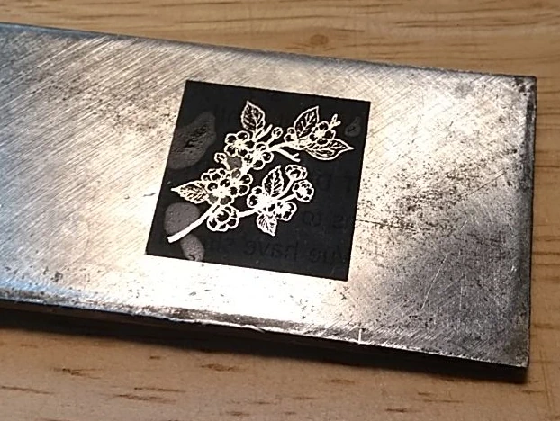
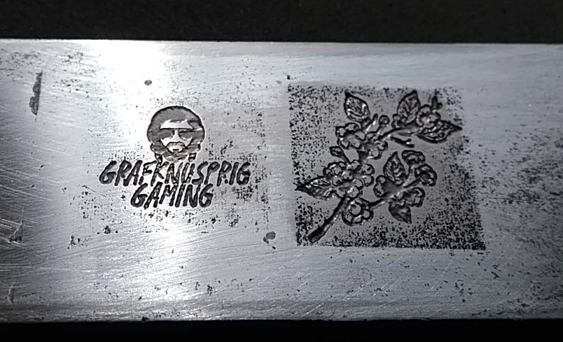
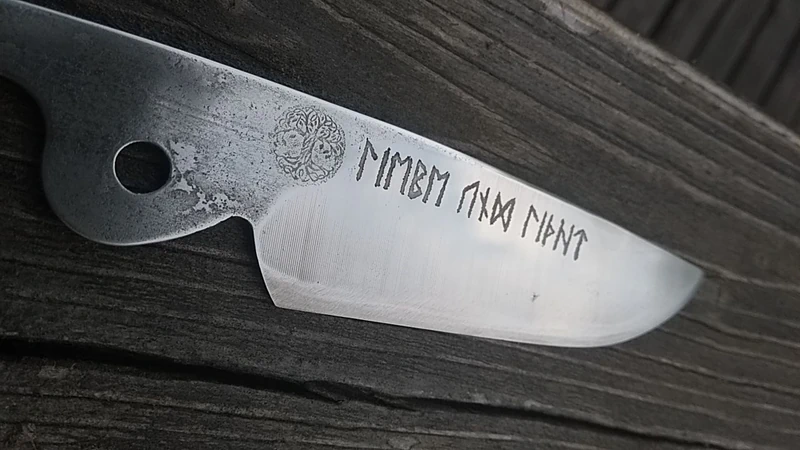

## I had an idea

I wanted to etch my own emblems, text and symbols on various things, especially knives.

The first method you think of is taking the dremel and just go for it.
But for more complex images, this process is hard and tedious.

I was looking for an easier method. More controlable and planable.

By chance I came across the salt etching process in a Youtube video. I did not know until then that such a thing exists.

Sure, you've heard of electrolysis in school and done a few experiments, but to use it for etching I found very exciting.

For me it had the great advantage that I had everything at home.

Of course, it is better to use the right electrolyte for the respective metal. But this is often very difficult to get and you almost have to be a chemist, or at least an enthusiastic hobbyist, to make it yourself.

Etching with salt unfortunately produces less favorable by-products, depending on the metal, but I didn't care about that for my little experiment.

## The masking

Masking is actually very fun and fascinating at the same time.

Simply put, everything that is not covered by paint or anything else is etched away.
So you have different possibilities to apply the design to the workpiece. 
I've often done it by painting the metal with acrylic varnish and then scratching in the design.

However, if you want to use a more complex or digital design, there is a very cool trick.
You can use a laser printer to print a design on thermal transfer paper in mirror image and then iron it onto the metal.
The cool thing is, every catalog and brochure is actually made of this paper. And you always have something like that on hand.

It can be a little tricky, but with a little practice you'll get the hang of it quickly.
You have to print on a very high setting, so that the color is as dense as possible.
Then take an iron on the highest setting and apply even pressure to the paper. It is advisable to put baking paper or a cloth in between.
Once the paper is ironed, let it cool completely. It will stick very tightly to the metal, which is a good thing.

Now comes the trick:

Wash the paper off the metal under running water and with a little soap. You have to be careful not to wash off the print.

Now you can see why it's better to use a thin catalog paper and not a thick one.

## The etching itself

is the most fun.

You need an insulating container, a nail or other metal part that serves as a kathode. The positive side is attached to the metal part to be etched.

Then you have to see how much current you let flow. I don't remember exactly, but I think I etched at 18V and 300mA.

It does not take long. After a few minutes you have a result. It can easily happen that you miss the point and you etch too deep.
Also, you must not etch with too much current, otherwise the paint or print can flake off very easily.

I strongly recommend doing this outside, as the etching can produce chlorine gas and other harmful fumes.

You can see that the process works when the area to be etched turns brown as oxides are formed there.

## Finally

one takes the workpiece out of the brine again and washes it under fresh water.
The laser print and varnish residues can be removed very easily with a little acetone.

The last step is to polish the metal. Simply use a polish of your choice.
I used Autosol metal polish. 

Have fun ;)
