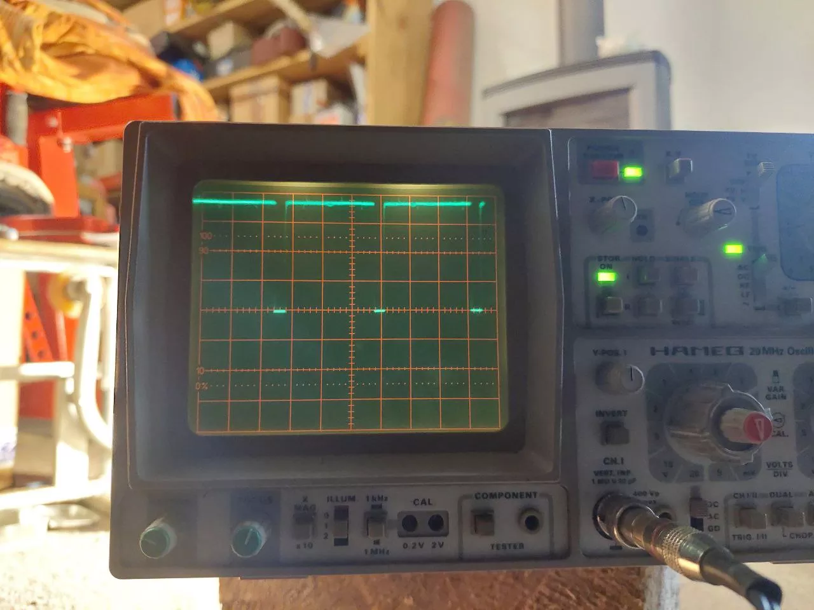
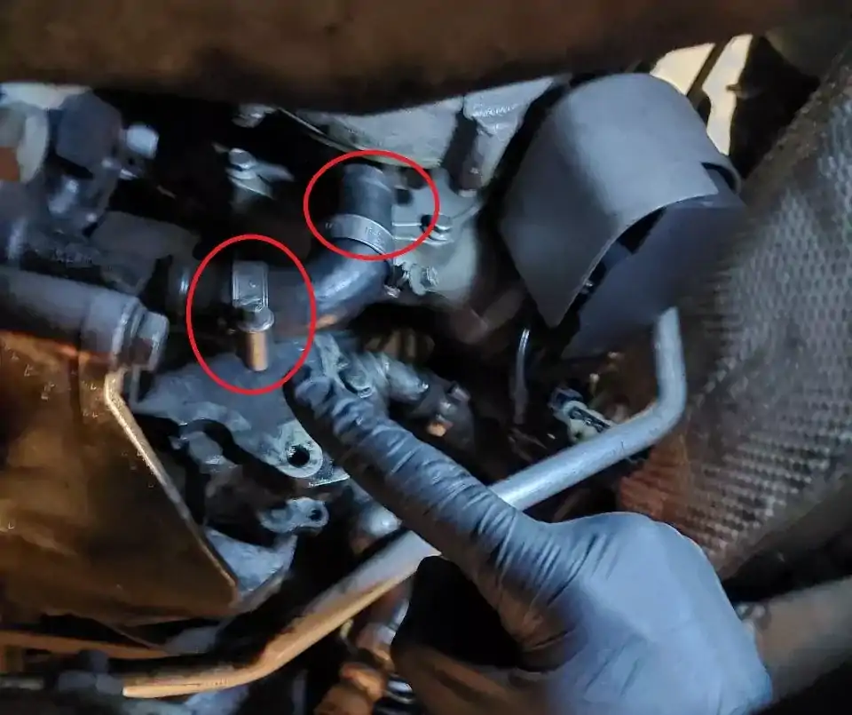
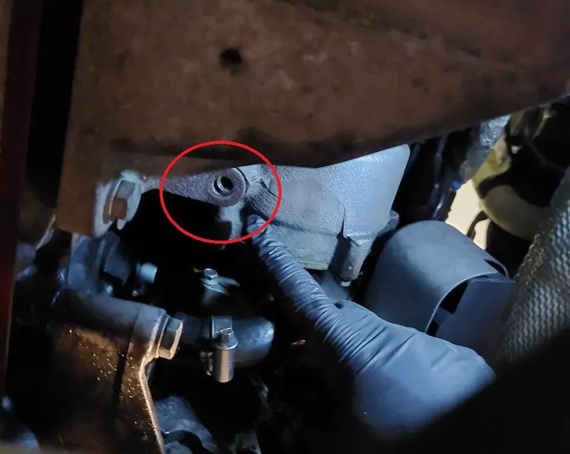
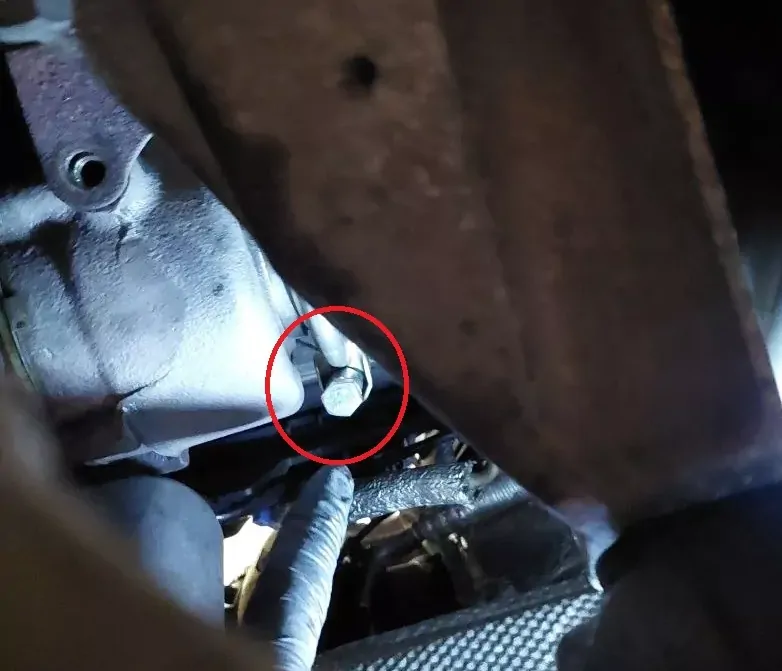
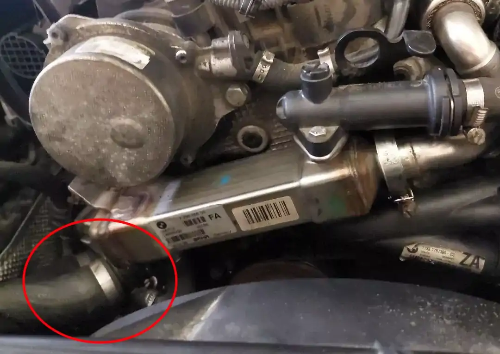
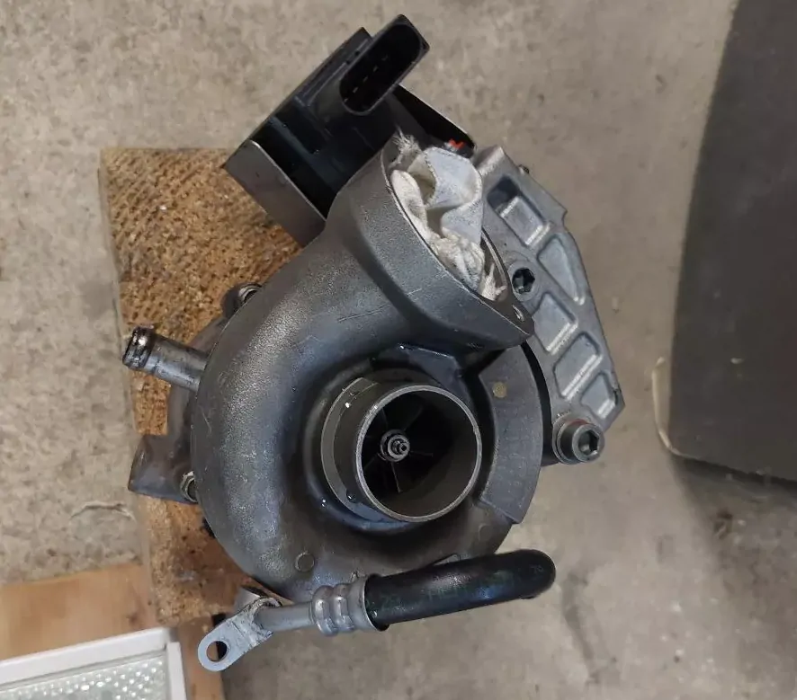

## How it came to this
3 weeks ago the turbo in my car broke.
To save money, I got a revised one on eBay.
After a week of delivery and 2 days in the workshop, the elation of success was immediately followed by great disillusionment.
As soon as I turned on the ignition, a strange humming sound came from the engine compartment.
On further investigation, the suspicion was confirmed: The boost control does not work.

I had to find out if the turbo charger was faulty, or my car.

The troubleshooting began:

- Oil was changed during turbo replacement
- New oil and air filter was installed
- DPF was cleaned
- Voltage supply was checked
- Signal at boost pressure regulator was checked
- The error memory was read and the static error code 44CC was found: Boost pressure controller defective

## Reading the controller signal

The reading of the actuator signal was the trickiest part.
A test wire was inserted into pin 4 of the turbocharger connector and measured against ground using an oscilloscope.

The signal matched the given values from the diganosis manual.

## Removing the turbo

A lot of coolant will spill in the process, so it's much nicer to loosen the bottom screws first.
The best way to do this is to jack up the car or drive onto a ramp or lifting platform and remove the underbody cover first.

- Loosen the hose clamps of the turbo oil outlet.

- Remove the bottom screw of the turbo.

- Fully open the clamp between the turbo and the catalytic converter.
  This tends to be tight and can be loosened with a long screwdriver either from below, or from above through the air filter chamber.

- Don't forget to unplug the cable.

From there on it continues above.
It's annoying, but more or less self-explanatory.

- Remove the plastic covers and the air hose.
- To remove the air filter cover, you have to remove the dome cross-brace.
- Next is the egr cooler, this can be a little tricky.

- 1: there are two torx screws to loosen
- 2: a long allen screw
- 3: a short allen screw
- 4: a not so shot allen screw :P
- 5: this hose clamp was really thight in my case and needed a lot of wiggeling to get loose
- 6: I disconnected the hose at the bottom
- 7, 8: two screws from the air channel
- At last you have to disconnect the hose at the bottom left. Attention! You need something to seal the hose after removing the egr cooler, because a lot of coolant will come out.

- Next step is to remove the compressor outlet channel. It's secured with an allen and a torx screw.
- Before we totaly loosen the turbo, remove the oil intake hose between the engine and the turbo.
- To loosen the top screws of the turbo, you have to remove 3 little rubber plugs in the air filter housing and the heat shield beneath them. There you find 3 12s double hex screws, which have 50Nm each.
- There is a little 10 nut on the left side of the turbo that secures another hose. You have to remove that, too.

That is it. Your turbo is now free. To get it out, rotate it 180° top to bottom and reverse dive it out.

To be continued...

I'm going to close this, because it's been a while and my car is doing fine so far with the replaced turbo charger. :)
